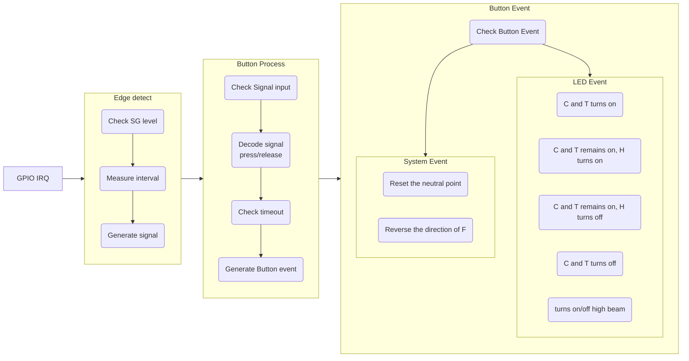
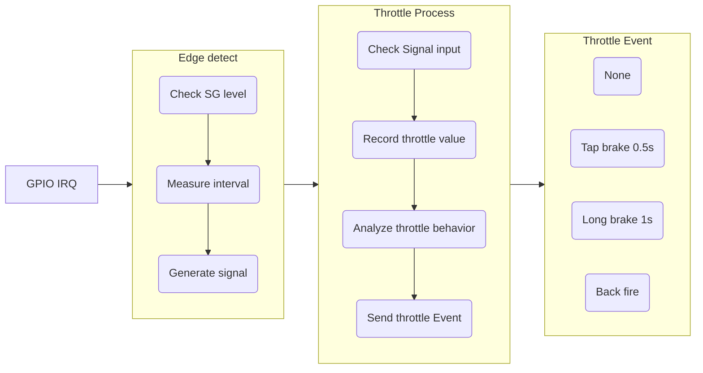

# Model Car

## Build

```shell
cmake ../app/model_car -G Ninja

ninja -j16

openocd -f tools/openocd/interface/cmsis-dap.cfg -f tools/openocd/target/stm32g0x.cfg -c "program build/model_car.elf verify reset exit"

pyocd reset
```

## CMD

```
led -i <0...5> -l <0...1>

btn -p <1...9>

thro -v <0...100>
```

## Code flow

- Button


- Throttle

