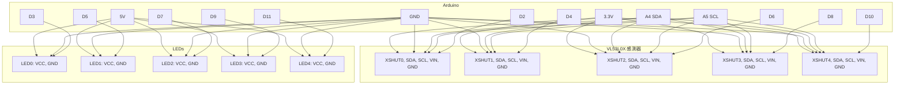

# Arduino ↔ VL53L0X 感測器與 LED 接線說明

## 📦 硬體架構

- **主控板：** Arduino UNO  
- **感測器：** VL53L0X 距離感測器 × 5  
- **LED 指示燈：** 通用 LED × 5  

---

## 🔌 電源與共用匯流排

| Arduino 腳位 | 接線對象        | 備註                         |
|--------------|------------------|------------------------------|
| `5V`         | 所有 LED 的 VCC  | LED 使用 5V 供電              |
| `3.3V`       | 所有感測器的 VIN | VL53L0X 建議使用 3.3V 供電     |
| `GND`        | 所有模組的 GND   | 共用地線                     |
| `A4` (SDA)   | 所有感測器的 SDA | I²C 資料線（共用）           |
| `A5` (SCL)   | 所有感測器的 SCL | I²C 時脈線（共用）           |

---

## 🎯 感測器與 LED 控制腳位對應表

| 編號 | 感測器 `XSHUT` 腳位 | LED 控制腳位 | 說明                      |
|------|----------------------|---------------|---------------------------|
| 0    | `D2` (`EN0`)         | `D3` (`LED0`) | 控制 Sensor 0 與 LED 0     |
| 1    | `D4` (`EN1`)         | `D5` (`LED1`) | 控制 Sensor 1 與 LED 1     |
| 2    | `D6` (`EN2`)         | `D7` (`LED2`) | 控制 Sensor 2 與 LED 2     |
| 3    | `D8` (`EN3`)         | `D9` (`LED3`) | 控制 Sensor 3 與 LED 3     |
| 4    | `D10` (`EN4`)        | `D11` (`LED4`)| 控制 Sensor 4 與 LED 4     |

---

## 🔧 感測器接腳說明（每顆 VL53L0X）

| 感測器腳位 | 對應 Arduino | 說明                     |
|------------|----------------|--------------------------|
| `VIN`      | `3.3V`          | 電源供應（建議 3.3V）     |
| `GND`      | `GND`           | 地線                     |
| `SDA`      | `A4`            | I²C 資料線（共用）        |
| `SCL`      | `A5`            | I²C 時脈線（共用）        |
| `XSHUT`    | `D2~D10`        | 開關用控制腳，設定 I²C 位址用 |

---

## 💡 LED 接腳說明（每顆 LED）

| LED 腳位 | 對應 Arduino | 說明              |
|----------|----------------|-------------------|
| `VCC`    | `5V`            | 電源供應           |
| `GND`    | `GND`           | 地線              |
| 控制腳   | `D3~D11`        | 數位輸出腳位控制    |

---

## ⚙️ 初始化流程（多顆感測器共用 I²C 匯流排）

由於 VL53L0X 無法設定預設位址，必須透過 `XSHUT` 腳進行個別啟動與位址設定：

1. 將所有 `XSHUT` 腳拉低（LOW）→ 關閉所有感測器。
2. 選擇一顆感測器將其 `XSHUT` 拉高（HIGH）→ 啟動該感測器。
3. 初始化感測器並設定一個新的 I²C 位址。
4. 重複步驟 2~3，直到所有感測器都啟動並設定完成。

---

## 🖼️ Mermaid 接線示意圖（可視化）

可貼到 [Mermaid Live Editor](https://mermaid.live) 觀看：

點我展開 Mermaid 圖

